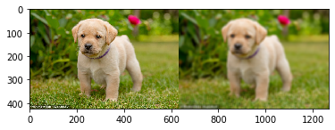

# OpenCV

---

## 1. Basic

#### 1.1. [특정 색 영역  추출(얼굴/ ChromaKey)](https://github.com/shiney5213/SamsungMultiCampus/blob/master/1.openCV/200106_day1_OpenCV기초%2C크로마키.ipynb)

- bgr값 plot으로 확인(histogram)

- Chromakey

- 빈도수가 가장 높은 값 확인

   ``` 
   max_r = (np.where(hr[0]==np.max(hr[0])))[0][0]
   ```


#### 1.2. [화소 점처리](https://github.com/shiney5213/SamsungMultiCampus/blob/master/1.openCV/200107_day2_2.화소점처리%2C클래핑%2CLUT%2Cgif_file%2Cpil_한글처리(np.clip%2Cnp.LUT).ipynb)
-  선형 연산
   -  Null tranform : output (q)= input(p)
   -  사칙연산: 일정 값을 더하기, 빼기, 나누기, 곱하기
   -  영상의 반전영상: output(q) = 255 - input(p)
   -  np.clip() : 0~255값을 유지(255 이상은 255, 0 이하는 0)
- 비선형변환
  - LUT(Look Up Table, mapping table)
    - binary LUT
    - reverce LUT
    - posterise LUT
    - gamma LUT
  <table>
      <tr>
      <td> </td>	
      <td> </td>	
      <td> </td>	
      <td> </td>
      </tr>
  </table>
  
- git 파일 만들기
- PIL로 한글 출력하기

#### 1.3. [화소 영역 처리](https://github.com/shiney5213/SamsungMultiCampus/blob/master/1.openCV/200108_day3_1.필터(다양한필터%2C정규화%2C1차미분%2C2차미분%2C엣지검출%2C이상치검출).ipynb)
- 화소 점처리: 픽셀 단위 값만 변경하는 것
- 화소 영역 처리: 픽셀 값과 그 주위 값(공간 영역) 연산
- 수동으로 kernel만들어 결과 확인하기
	- 평균으로 bluering
	- 자기 자신을 이용한 kernerl
	- sharp효과
	- 수평 엣지 찾기
	

#### 1.4. [공간 정보 인코딩(필터)](https://github.com/shiney5213/SamsungMultiCampus/blob/master/1.openCV/200108_day3_1.%ED%95%84%ED%84%B0(%EB%8B%A4%EC%96%91%ED%95%9C%20%ED%95%84%ED%84%B0%2C%EC%A0%95%EA%B7%9C%ED%99%94%2C1%EC%B0%A8%EB%AF%B8%EB%B6%84%2C2%EC%B0%A8%20%EB%AF%B8%EB%B6%84%2C%EC%97%A3%EC%A7%80%20%EA%B2%80%EC%B6%9C%2C%EC%9D%B4%EC%83%81%EC%B9%98%20%EA%B2%80%EC%B6%9C).ipynb)


- 화소 마스크= 회선 필터 = 회선 처리 = 컨볼루션
- 회선 마스크: 주변 픽셀과의 평균 사용 
- 종류
	- 엠보싱
	- 블러링
	- 샤프닝
	- 경계선 검출(수직, 수평)
		- 1차 미분을 이용한 edge 검출
		
		- 2차 미분을 이용한 edge 검출
		
		  
	- 잡음 제거
		- 가우시안 blur
		
		- 소벨 필터
		
		- median blur
		
		  
	
#### 1.5.[analog to digital ](https://github.com/shiney5213/SamsungMultiCampus/blob/master/1.openCV/200108_day3_2.아날로그신호_to_디지털신호.ipynb)
-  표준화 단계
-  양자화 단계
-  부호화 단계

---
## 2. shape_detection

#### 2.1 [binary processing](https://github.com/shiney5213/SamsungMultiCampus/blob/master/1.openCV/200109_day4_1.binary_processing(threshold%2C).ipynb)
- binary threshold
	- cv2.threshold() :  histogram보고 thheshold 적용  
	- cv2.THRESH_OTSU: 역치값을 찾는 알고리즘 이용
	- cv2.adaptiveThreshold: adaptive threshole값 찾기
	
	  
- noise 제거 후, threshold
	
	- GaussianBlur - threshold
	


#### 2.2. [shape detection](https://github.com/shiney5213/SamsungMultiCampus/blob/master/1.openCV/200109_day4_2.shape_detection(contour%2C%20morphologyEx).ipynb)

-  외곽선 검출
	- cv2.findContours() 
	- cv2.drawContours(): 외곽선 그리기
- 외곽선 개수에 따라 도형 확인하기
	
	- cv2.approxPolyDP(): contours에서 꼭지점 개수 찾기
	
	  
- Morphology: cv2.morphologyEx()
  - 팽창: cv2.MORPH_DILATE 
  
  - 침식: cv2.MORPH_ERODE
  
  - open:cv2.MORPH_OPEN ->침식 후 팽창(뾰족한 부분들이 없엉짐)
  
  - close:  cv2.MORPH_CLOSE ->팽창 후 침식(구멍들이 메워짐.)
  
  - 
  
  - 예제: 동전 찾기, 영수증 찾기
  
    <table>
        <tr>
        <td></td>
        <td></td>
        </tr>
    </table>
  
    
  

---

## 3. [OCR](https://github.com/shiney5213/SamsungMultiCampus/blob/master/1.openCV/200110_day5_1.ocr_program.ipynb)
- tesseract_ocr

  ```
  import pytesseract
  
  # 환경변수 설정을 안했기 때문에 위치를 지정
  pytesseract.pytesseract.tesseract_cmd = r'C:\Program Files\Tesseract-OCR/tesseract.exe'
  str = pytesseract.image_to_string('./images/bill.jpg')
  ```
  ---
  
## 4.Object detection
#### 4.1. blur로 노이즈 없애기
  - cv2.GaussianBlur()

#### 4.2. 외곽선 찾기
  - cv2.canny(): 외곽선인지 아닌지 찾기
  - cv2.countour(): 외곽선 찾기
  - cv2.morphologyEx(): 끊어진 점 연결
  - cv2. HoughCircles(): 원 찾는 함수
<table>
    <tr>
    <td></td>
    <td></td>
    <td></td>
    </tr>
</table>

---
## 5. [shape transformation](https://github.com/shiney5213/SamsungMultiCampus/blob/master/1.openCV/200110_day5_3.affin_transformation.ipynb)
#### 5.1. flip
- cv2.flip()
#### 5.2. resize
- cv2.resize()
#### 5.3. crop
- 슬라이스 이용: img_crop = img[100:300,120:240]
#### 5.4. shift
```
M = np.float32([[1,0,10],  # x축으로 10
                [0,1,20]])   # y축으로 20
img_des = cv2.warpAffine(img, 
                   M,   # 이동할 행렬
                   dsize= (width, height),  # 출력할 이미지 크기 
                   borderValue = (255,255,255)  # 빈공간 채우기, 
                   )
                       
```

#### 5.5. rotate, scale

```
M = cv2.getRotationMatrix2D(img_center,   # 중심점
                            angle= 45,    # 몇 도인지(사람의 개념으로), 반식 방향으로
                            scale= 1.0)   # scale 조절
img_rotate = cv2.warpAffine(img, M, (width, height), borderValue = (255,255,255))
```


#### 5.6 rotate, perspective

```
M = cv2.getPerspectiveTransform(pts1, pts2)
img_result = cv2.warpPerspective(img, M, (width, height))
```

<table>
    <tr>
    <td></td>
    <td></td>
    <td></td>
    <td></td>
    </tr>
</table>

5.7. 예제

- 영수증

- 폴라로이드 사진

- 명함

  <table>
      <tr>
      <td></td>
      <td></td>
      <td></td>
      <td></td>
      </tr>
      <tr>
      <td></td>
      <td></td>
      <td></td>
      <td></td>
      </tr>
  </table>

---

## [6. corner 검출](https://github.com/shiney5213/SamsungMultiCampus/blob/master/1.openCV/200114_day6_1.corrner(cv2.cornerHarris%2Cfeature_detector).ipynb)

#### 6.1. corner 찾기
- cv2.cornerHarris()
#### 6.2 featureDetector
- cv2.FastFeatureDetector_create(threshold=50)

  ```html
  <table>
  <tr>
  <td></td>
  <td></td>
  <td></td>
  </tr>
  </table>
  ```

  
#### [예제: QRcode](https://github.com/shiney5213/SamsungMultiCampus/blob/master/1.openCV/200114_day6_2.corner%EB%A5%BC_%EC%9D%B4%EC%9A%A9%ED%95%9C_QRcode.ipynb)
- corner 찾기

- QRcode 인식, 생성

  <table>
  <tr>
  <td></td>
  <td></td>
  <td></td>
  </tr>
  </table>
#### 6.3.[고급코너검출](https://github.com/shiney5213/SamsungMultiCampus/blob/master/1.openCV/200114_day6_3.%EB%B3%B5%EC%9E%A1%ED%95%9C_corner%EB%AC%B8%EC%A0%9C%20%ED%95%B4%EA%B2%B0(ORB.detect%2C_cv2.BFMatcher_create%2C_drawMatches%2C%20cv2.Stitcher).ipynb)
- SIFT(Scale-Invariant Feature Transform)
- ORB: cv2.ORB_create()
#### 6.4. 거리재서 매칭점 찾기
- 유클리디안 distance

- 해밍 distance: cv2.BFMatcher_create(cv2.NORM_HAMMING)

- <table>
  <tr>
  <td></td>
  <td></td>
  </tr>
  </table>
#### 예제: 두 과자 이미지에서 코너점 검출해서 배교
- 파노라마: cv2.Stitcher_create()