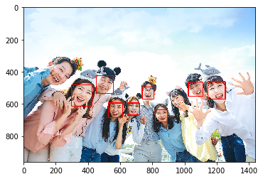
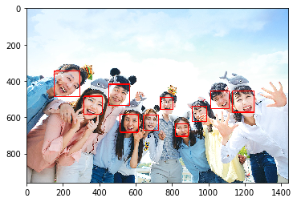
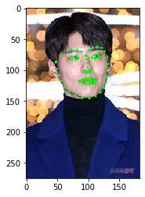
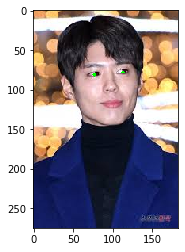
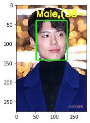
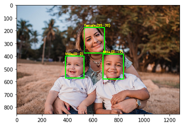
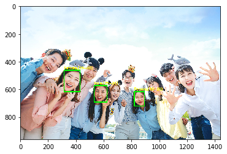
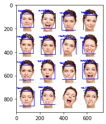
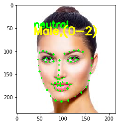

# Face Recognition

---

## 1. [얼굴인식 API](https://github.com/shiney5213/SamsungMultiCampus/blob/master/4.FaceAnalsys/200130_day1_1.%EC%96%BC%EA%B5%B4%EC%9D%B8%EC%8B%9D_(dlib%2C%20face-recognition).ipynb)

#### 1.1 설치
- dlib
	- https://pypi.org/simple/dlib/svm 
	- dlib-19.8.1-cp36-cp36m-win_amd64.whl
	- python 3.6 사용해야 함.

- face_recognition
	- pip install --no-dependencies face_recognition
	- no dependenceis 안하면 dlib을 또 받아서 에러남

#### 1.2.얼굴 검출
- HOG 알고리즘으로 검출
```
img = cv2.imread("./images/group.jpg")
face_locations = face_recognition.face_locations(img)

for face_location in face_locations:    
    top, right, bottom, left = face_location
    cv2.rectangle(img, (left, top),  (right, bottom), (0, 0, 255), 3)  
imshow("", img)
```
- CNN 알고리즘으로 검출

```
img = cv2.imread("./images/group.jpg")
face_locations = face_recognition.face_locations(img)

for face_location in face_locations:    
    top, right, bottom, left = face_location
    cv2.rectangle(img, (left, top),  (right, bottom), (0, 0, 255), 3)  
imshow("", img)
```
- 68 face landmarks 이용

  ```
  predictor = dlib.shape_predictor("shape_predictor_68_face_landmarks.dat")
  detector = dlib.get_frontal_face_detector()
  rects = detector(gray, 0)  
  for k, d in enumerate(rects):
     print("Detection {}: Left: {} Top: {} Right: {} Bottom: {}".format(
            k, d.left(), d.top(), d.right(), d.bottom()))
      shape = predictor(gray, d)
      shape = face_utils.shape_to_np(shape)
      for (x, y) in shape:
          cv2.circle(frame, (x, y), 2, (0, 255, 0), -1)
  ```

  <table>
  <tr>
  <td></td>
  <td></td>
  <td></td>
  <td></td>
  </tr>
  </table>

#### 1.3. embedding
```
img = face_recognition.load_image_file("./images/face3.jpg")
face_encoding = face_recognition.face_encodings(img)
```

#### 1.4 이미지간 유사도 비교: 

```
for encoding in encodings:
    
    # db의 feature vector들과 test의 feature vector 비교
    matches = face_recognition.compare_faces(data["encodings"], encoding)
    name = "Unknown"
    
    if True in matches:
        matchedIdxs = [i for (i, b) in enumerate(matches) if b]
        counts = {} 
        
        # 매칭되는 이미지가 많을 때 어디에 더 가까운지 확인하기위해
        # count라는 dict에 key가 이미지, value가 높은 숫자의 key가 선택됨.
        # voting의 개념...
        for i in matchedIdxs:
            # key가 없을 때 counts['song']=1 의 뜻
            name = data["names"][i]
            counts[name] = counts.get(name, 0) + 1 
        print(counts)
        name = max(counts, key=counts.get)
    names.append(name)     

print(names)
```

#### 1.5 이미지 분류 모델

```
model = keras.Sequential([
    keras.layers.Dense(10,input_shape=(128,),activation='relu'),
    keras.layers.Dense(64, activation='relu'),
    keras.layers.Dense(128, activation='relu'),
    keras.layers.Dense(256, activation='relu'),
    keras.layers.Dense(128, activation='relu'),
    keras.layers.Dense(64, activation='relu'),

    keras.layers.Dense(4, activation='softmax')
])
```


## 2. [Age Net, Gender Net](https://github.com/shiney5213/SamsungMultiCampus/blob/master/4.FaceAnalsys/200131_day2_3.agenet%2Cgendernet.ipynb)

#### 2.1. model

```
faceProto = "./agegender/opencv_face_detector.pbtxt"
faceModel = "./agegender/opencv_face_detector_uint8.pb"

ageProto = "./agegender/age_deploy.prototxt"
ageModel = "./agegender/age_net.caffemodel"

genderProto = "./agegender/gender_deploy.prototxt"
genderModel = "./agegender/gender_net.caffemodel"

ageList = ['(0-2)', '(4-6)', '(8-12)', '(15-20)', '(25-32)', '(38-43)', '(48-53)', '(60-100)']
genderList = ['Male', 'Female']

# Load network
ageNet = cv2.dnn.readNet(ageModel, ageProto)
genderNet = cv2.dnn.readNet(genderModel, genderProto)
faceNet = cv2.dnn.readNet(faceModel, faceProto)
```

#### 2.2. predict

```
frame = cv2.imread("./images/my.jpg")
frameFace, bboxes = getFaceBox(faceNet, frame)
# 얼굴의 범위를 넓혀주는 범위의 값 : 100이 되니 정확도가 높아짐!
padding=100
for bbox in bboxes:
    # 얼굴 자르기
        face = frame[max(0,bbox[1]-padding):min(bbox[3]+padding,frame.shape[0]-1),max(0,bbox[0]-padding):min(bbox[2]+padding, frame.shape[1]-1)]

        blob = cv2.dnn.blobFromImage(face, 1.0, (227, 227),(78.4263377603, 87.7689143744, 114.895847746), swapRB=False)
        genderNet.setInput(blob)
        genderPreds = genderNet.forward()
        gender = genderList[genderPreds[0].argmax()]
        print("Gender : {}, conf = {:.3f}".format(gender, genderPreds[0].max()))

        ageNet.setInput(blob)
        agePreds = ageNet.forward()
        age = ageList[agePreds[0].argmax()]
        print("Age Output : {}".format(agePreds))
        print("Age : {}, conf = {:.3f}".format(age, agePreds[0].max()))

        label = "{},{}".format(gender, age)
        cv2.putText(frameFace, label, (bbox[0], bbox[1]-10), cv2.FONT_HERSHEY_SIMPLEX, 0.8, (0, 255, 255), 2, cv2.LINE_AA)        
```

<table>
<tr>
<td></td>
<td></td>
<td></td>
</tr>
</table>


## 3. [Emotion expression](https://github.com/shiney5213/SamsungMultiCampus/blob/master/4.FaceAnalsys/200131_day2_4.감정인식.ipynb)

```
image_path = "./emotion/tes.jpg"
detection_model_path = './emotion/haarcascade_frontalface_alt2.xml'
emotion_model_path = './emotion/fer2013_big_XCEPTION.54-0.66.hdf5'
emotion_model_path = "./emotion/emotion_temp.h5"
emotion_labels = {0:'angry',1:'disgust',2:'fear',3:'happy',4:'sad',5:'surprise',6:'neutral'}
font = cv2.FONT_HERSHEY_SIMPLEX

emotion_offsets = (0, 0)

# loading models
face_detection = load_detection_model(detection_model_path)
emotion_classifier = load_model(emotion_model_path, compile=False)
emotion_target_size = emotion_classifier.input_shape[1:3]
```

```
faces = detect_faces(face_detection, gray_image)

for face_coordinates in faces:   
    
    x1, x2, y1, y2 = apply_offsets(face_coordinates, emotion_offsets)
    gray_face = gray_image[y1:y2, x1:x2]

    gray_face = cv2.resize(gray_face, (emotion_target_size))

    gray_face = preprocess_input(gray_face, True)
    gray_face = np.expand_dims(gray_face, 0) # 앞에 1차원 추가    
    gray_face = np.expand_dims(gray_face, -1) # 뒤에 1차원 추가
    
    emotion_label_arg = np.argmax(emotion_classifier.predict(gray_face))
    emotion_text = emotion_labels[emotion_label_arg]
    
    color = (255, 0, 0)

    draw_bounding_box(face_coordinates, rgb_image, color)
    draw_text(face_coordinates, rgb_image, emotion_text, color, -20, -20, 0.7, 2)

cv2.imwrite('./emotion/out.jpg', rgb_image)
```


## 5. [Shape+Age+Gender+Emotion](https://github.com/shiney5213/SamsungMultiCampus/blob/master/4.FaceAnalsys/200131_day2_5.%EC%96%BC%EA%B5%B4all_function(shape%2Cage%2Cgender%2Cemotion).ipynb)

<table>
<tr>
<td></td>
<td></td>
</tr>
</table>


---

기타

- [google vision AI](https://github.com/shiney5213/SamsungMultiCampus/blob/master/4.FaceAnalsys/200131_day2_1.google_visionAI.ipynb)
  - https://cloud.google.com/vision